# SentinelShield Workflow Diagram

This diagram visualizes how the different user roles (Viewer, Admin) and the AI Engine interact within the SentinelShield prototype.

If your code editor supports Mermaid diagrams (like VS Code with a Markdown Preview extension, or GitHub), this diagram will render visually.

```mermaid
%%{init: {'theme': 'dark', 'themeVariables': { 'primaryColor': '#0f172a', 'primaryTextColor': '#fff', 'primaryBorderColor': '#3b82f6', 'lineColor': '#60a5fa', 'secondaryColor': '#1e293b', 'tertiaryColor': '#1e293b'}}}%%
graph TD
    %% Define Styles
    classDef userRole fill:#3b82f6,stroke:#60a5fa,stroke-width:2px,color:#fff,font-weight:bold;
    classDef adminRole fill:#8b5cf6,stroke:#a78bfa,stroke-width:2px,color:#fff,font-weight:bold;
    classDef system fill:#0f172a,stroke:#3b82f6,stroke-width:1px,color:#fff;
    classDef aiEngine fill:#1e293b,stroke:#06b6d4,stroke-width:2px,color:#06b6d4,stroke-dasharray: 5 5;
    classDef alert fill:#ef4444,stroke:#fca5a5,stroke-width:1px,color:#fff;
    classDef action fill:#10b981,stroke:#34d399,stroke-width:1px,color:#fff;

    %% Entry Points
    User(["👤 Viewer (Employee/User)"]):::userRole
    Admin(["👑 Admin (Security Lead / Analyst)"]):::adminRole

    %% Viewer Flow
    User -->|Submits Text/URL/File| PrivacyToggle{"Privacy Mode<br>Enabled?"}:::system
    PrivacyToggle -- Yes --> Redact["Auto-Redact PII<br>(Names, Emails, SSN)"]:::system
    PrivacyToggle -- No --> Scan["Standard Scan"]:::system
    
    Redact --> AIEngine
    Scan --> AIEngine

    %% AI Engine Processing
    subgraph AIEngineGroup [🧠 SentinelShield AI Engine]
        AIEngine["Multimodal Analysis<br>(NLP, Vision, URL checks)"]:::aiEngine
        Score["Calculate Threat Score<br>(0-100)"]:::aiEngine
        XAI["Generate XAI Explanation<br>(Why Flagged)"]:::aiEngine
        Conf["Calculate Confidence Level"]:::aiEngine
        
        AIEngine --> Score --> XAI & Conf
    end

    %% Routing based on Score/Rules
    Conf & XAI --> RuleCheck{"Match Custom<br>Admin Rules?"}:::system
    RuleCheck -- No Match --> Result["Return Safe Result<br>to Viewer"]:::system
    RuleCheck -- "Match (e.g. Score > 70)" --> AlertGen["Generate Alert"]:::alert
    
    %% Alert Handling & Triage (Admin does this now)
    AlertGen --> DB[("MongoDB<br>Data Store")]:::system
    DB --> AdminTriage["Threat Triage Workspace"]:::system
    Admin -->|Reviews Alerts| AdminTriage
    
    %% Admin Triage Decision
    AdminTriage --> Decision{"Admin<br>Decision"}:::system
    Decision -- "Accept" --> Block["Execute Block Policy"]:::action
    Decision -- "Dismiss" --> FP["Mark False Positive"]:::action
    Decision -- "Escalate" --> Escalate["Log Escalation"]:::alert
    
    %% Accountability & Timeline
    Block & FP & Escalate --> ReasonTag["Attach Reason Tag<br>(Accountability)"]:::system
    ReasonTag --> AuditLog[("Audit Logs &<br>Incident Timeline")]:::system

    %% Admin Oversight & System Control
    Admin -->|Monitors Overall System| AdminDash["Command Center / Analytics"]:::system
    AuditLog --> AdminDash
    AdminDash --> CreateRules["Create/Edit Security Rules"]:::system
    CreateRules -.->|Updates Logic| RuleCheck
    AdminDash --> UserControl["Suspend Users /<br>Change Roles"]:::system
    AdminDash --> WipeData["Privacy Wipes /<br>Retention Policies"]:::system

    %% Feedback loops
    User -.-|Views| History["Threat History &<br>Personal Activity"]:::system
    DB -.- History
```

### Key Highlights of this Workflow:
1. **Privacy First (Viewer)**: The workflow explicitly starts with the Privacy Toggle, showing data redaction *before* AI processing.
2. **AI Transparency (Engine)**: The AI Engine step highlights generating an Explainable AI (XAI) reason and a Confidence score, not just a binary threat output.
3. **Consolidated Security Ops (Admin)**: The Admin serves as the central security operations center (SOC), handling alert triage directly, defining rules, tracking incident timelines, and maintaining system accountability with reason tags.
4. **Accountability Loop**: Every triage decision goes through a "Reason Tag" gate before being saved to the Audit Log/Incident Timeline, providing a tamper-proof history of who blocked what and why.
